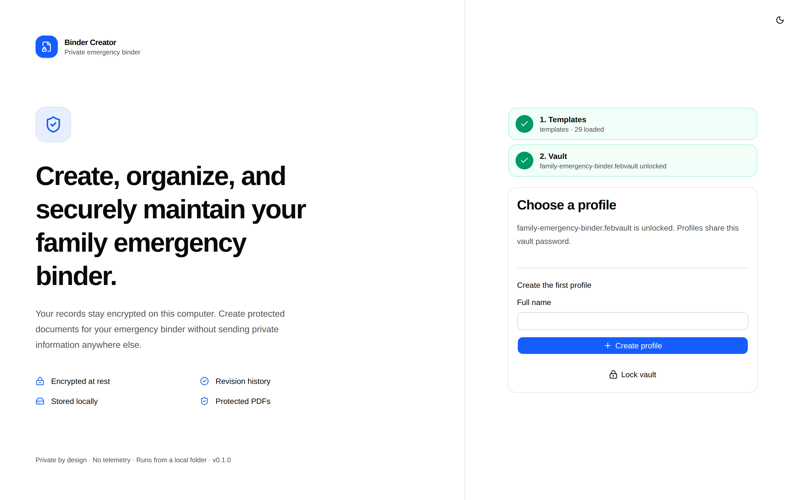
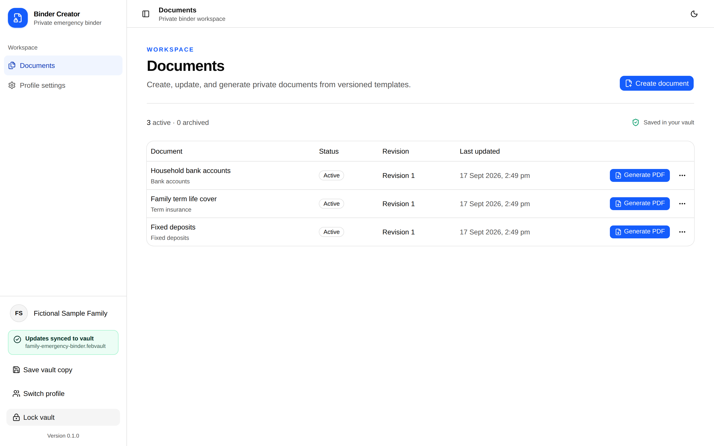
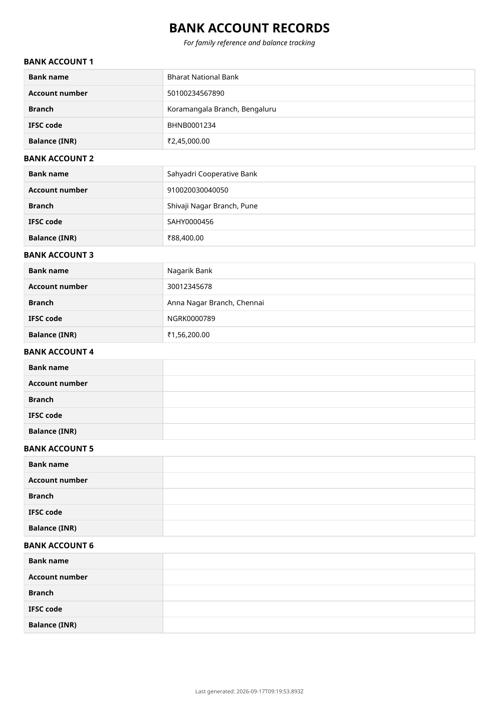

# Family Emergency Binder Creator

A portable, local-first application for creating, updating, and printing the documents a family may need during an emergency.

[](https://github.com/shriram-ethiraj/family-emergency-binder/actions/workflows/ci.yml)
[](https://github.com/shriram-ethiraj/family-emergency-binder/releases/latest)
[](https://github.com/shriram-ethiraj/family-emergency-binder/releases)

Family Emergency Binder Creator gives you one dedicated place to maintain structured family records and regenerate consistent, password-protected PDFs whenever information changes. It runs from an extracted folder in a current desktop browser. There is no installer, server, account, cloud service, or internet connection required.

## Download

**[Download the latest release](https://github.com/shriram-ethiraj/family-emergency-binder/releases/latest)**

Download the release ZIP and its matching SHA-256 checksum, then extract the ZIP. Keep the extracted folder together: the HTML file depends on the adjacent `assets/` and `templates/` directories.

## What it does

- Uses reusable templates to provide consistent forms for accounts, insurance policies, contacts, and other emergency records.
- Stores profiles, documents, revisions, and template snapshots in one encrypted `.febvault` file.
- Makes ongoing maintenance easier: update the structured record, then generate a fresh PDF instead of editing several independent office documents.
- Generates password-protected PDFs for saving and printing.
- Supports custom JSON templates created manually or with help from an AI tool.
- Runs locally with networking disabled in the production package.

## Screenshots

Every session starts the same way: load the `templates` folder, then open or create an encrypted `.febvault`. After unlocking, one workspace holds every document for the selected profile.



*Load the `templates` folder and unlock your encrypted `.febvault`, then create or choose a profile.*



*Every profile keeps its documents, revisions, and PDF actions together in one workspace.*



*Each document generates a consistent, printable, password-protected PDF. The sample above uses plainly fictional bank details.*

## Use the application

1. Extract the release ZIP without moving files out of the extracted folder.
2. Open `family-emergency-binder.html` in a current Chrome, Edge, or compatible Chromium browser.
3. When prompted, choose the extracted `templates` directory. Templates are validated and held in memory for this browser session.
4. Select an existing `.febvault`, or create a new vault and save it somewhere you can back up safely.
5. Enter the vault password, then choose or create a family profile.
6. Create a document from a template and enter the information you want to maintain.
7. Open the document's generation view, choose a separate PDF password, and save the generated PDF.
8. Print the PDF or store it according to your family's emergency plan.
9. Wait for the application to show **Saved** before closing the browser, copying the vault, or ejecting removable storage.

Refreshing or closing the page clears the selected template directory and the unlocked vault from the browser session. Select them again the next time you open the app.

### Vaults, recovery, and backups

A vault password protects every profile in a `.febvault`. When you create a vault, the application also shows a recovery key once. Store that key separately from both the password and every copy of the vault; it is the only supported way to regain access if the password is forgotten.

Keep more than one current backup of the vault. Do not edit the same vault concurrently in multiple browser windows or on multiple computers.

Chrome, Edge, and compatible Chromium browsers can update the selected vault in place. Firefox and Safari use compatibility mode: they open a vault through a file chooser and download a new encrypted copy after changes. In compatibility mode, always use **Download updated vault** when shown and retain the newest download.

## Custom templates

Place additional JSON template files directly in, or in subdirectories under, the release's `templates/` directory. Close and reopen the app, then select that directory again. The app reads template files but never modifies them.

See **[Creating custom templates](docs/custom-templates.md)** for the complete format, a working example, validation rules, testing instructions, and a prompt you can give to an AI assistant.

## FAQ

### Why use this instead of Word or LibreOffice templates?

Word and LibreOffice are excellent general-purpose editors, but a folder of separate documents can become difficult to update consistently over time. Family Emergency Binder Creator provides a dedicated environment with structured forms, reusable templates, an encrypted local vault, immutable document revisions, and repeatable PDF generation. You update the maintained record and generate a new printable copy instead of manually synchronizing several office files.

### Can I keep the app on an encrypted pen drive?

Yes. You can keep the complete extracted application folder, its templates, and the encrypted `.febvault` together on encrypted removable storage. You can then open the app on another trusted computer that has a current supported desktop browser.

The vault remains encrypted by the application, while drive encryption adds another layer around the files on the device. Always wait for **Saved**, close the browser, and eject the drive safely. An encrypted drive does not make an untrusted computer safe: the operating system, browser, extensions, and other software can access information while the vault is unlocked.

### Does it require installation or internet access?

No. End users only need the extracted release folder and a current desktop browser. The production application does not need Node.js, a web server, an account, or an internet connection.

### Where is my family information stored?

Your profiles, document values, labels, revisions, and fallback template snapshots are stored inside the selected encrypted `.febvault`. They are not sent to an application server or cloud account. Template files define form structure and fictional examples; they should never contain your real family information.

### How does it make ongoing maintenance easier?

The app keeps structured records and their revisions in one vault. When a phone number, account, policy, or contact changes, edit the relevant record and regenerate its PDF. You do not have to find and synchronize the same value across several independently edited documents.

### Can I create my own document types?

Yes. Add a JSON template under `templates/` and select that directory when the app starts. The [custom-template guide](docs/custom-templates.md) explains the format and includes a constrained AI prompt for generating a starting template.

### What happens if I forget the vault password?

Use the recovery key that was displayed when the vault was created. The recovery key lets you replace a forgotten password. If both the password and recovery key are lost, the encrypted vault cannot be recovered.

### Which browser should I use?

Use a current Chrome, Edge, or compatible Chromium browser for the simplest experience and direct in-place vault saving. Firefox and Safari are supported through compatibility mode, which downloads a new encrypted vault copy after changes.

### Does encryption protect an open vault from everything?

No. Encryption protects a closed vault file at rest. It cannot protect information in an unlocked session from the operating system, malware, browser extensions, screenshots, swap, a privileged user, or modified application files. Use the app only on a computer and browser you trust.

## Development

Development requires Node.js 24.21 or later and pnpm 10.11. End users do not need either.

```text
pnpm install
pnpm dev
pnpm typecheck
pnpm lint
pnpm test
pnpm test:e2e
pnpm package
```

`pnpm build` emits the portable folder under `dist/family-emergency-binder/`. `pnpm package` also creates a versioned ZIP and SHA-256 checksum while enforcing the HTML and archive size budgets.

Pushing a `vMAJOR.MINOR.PATCH` tag that matches `package.json` and points to a commit on `main` runs the complete release checks and creates a draft GitHub Release. Verify the draft assets before publishing it.

## Security

The supported boundary is a single-user deployment opened from one trusted extracted application folder. Selected template JSON is treated as untrusted, bounded data, but the application HTML, fixed assets, browser, extensions, operating system, and privileged host users are trusted while a vault is unlocked.

Read [SECURITY.md](SECURITY.md) before reporting a security problem. Never attach a real vault, recovery key, password, generated PDF, or personal record value to a public issue.

## License

[MIT](LICENSE)
